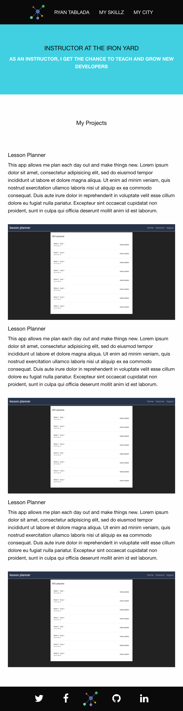
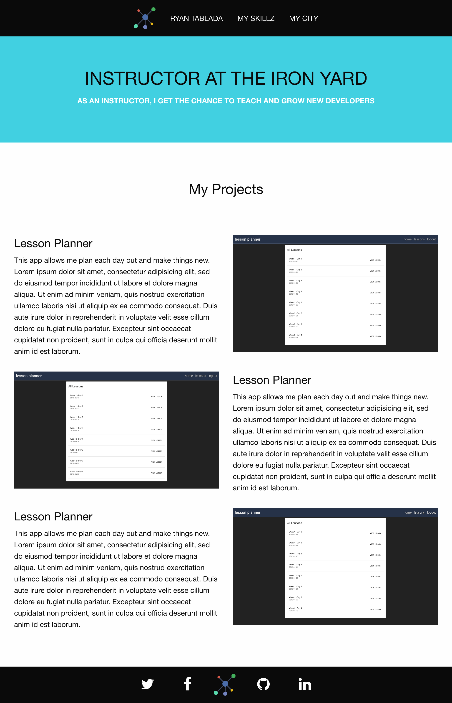
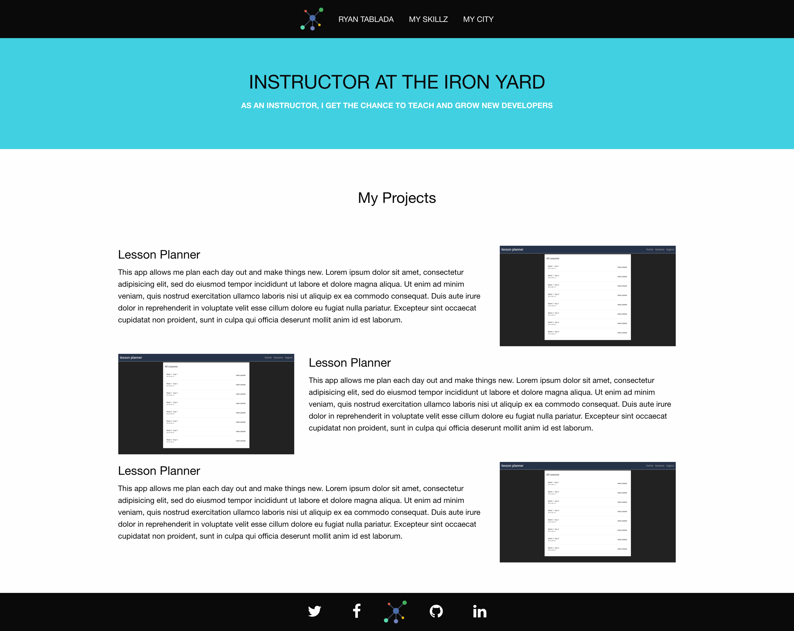

# Portfolio Site

## Description

For this assignment, you'll be pulling together your skills understanding HTML, layout, SASS, flexbox and more.
Here, you'll be creating a portfolio site for yourself and taking some time to reflect on the last two weeks of the course.

## Objectives

### Learning Objectives

After completing this assignment, you should be able to:

* Add libraries via `npm` and included in the `Brocfile.js`
* Use `@extend`

### Review Objectives

After completing this assignment, you should be able to effectively use:

* Use Media Queries
* Use flex-box to create a grid with gutters
* Use flex-box to stack content
* Use `flex-grow` and `min-width` to make a responsive grid
* Organize SASS using variables
* Organize SASS using `@import` statements
* Create SASS code free of linting errors
* Use `position: relative` and `position: absolute` to create tool tips

## Grading Criteria

* Use of CSSGram for image filtering
* Use of SASS variables for configuration
* Logical uses of `import`, and `extend`
* Desktop Grid Layout
* Tablet Grid Layout
* Mobile Grid Layout
* Hover States for Photo Grid Page

## Details

### Deliverables

* A project started with `sass-broccoli` Yeoman Generator
* `public/index.html` showing off your work
* `public/city.html` showing off Nashville

### Requirements

Recreate the following pages using HTML and SASS

#### Skillz - Mobile



#### Skillz - Tablet



#### Skillz - Desktop



#### City - Mobile


#### City - Tablet


#### City - Desktop


>You should replicate the design as closely as possible (don't take creative liberties with this one).

> You should make sizes and colors configurable with SASS variables

The designer has given you a few things to work with:
* Gutter: `1rem`;
* Max Content Width: `60rem`


## Tasks

```
* [ ] Create a new project using `yo sass-broccoli` name the project `06-tshirts`
* [ ] Initialize new folder as git repository
* [ ] Using `hub` create a new repository on github
* [ ] Checkpoint: Commit code from HTML grouping workshop to `master branch`
* [ ] Make one change to project and commit changes
* [ ] Push changes to `origin` `develop` branch
* [ ] Create a pull request using the `hub` CLI
* [ ] **PAGE**: Skillz `public/index.html`
  - [ ] **GOAL**: Top Navigation
    * [ ] Logo [Copy this to `public/img/logo.svg`](./network.svg)
    * [ ] Name
    * [ ] Skills (This should link to `/`)
    * [ ] City (This should link to `/city.html`)
  - [ ] **GOAL**: Hero
  - [ ] **GOAL**: Projects/Skillz
    * [ ] Content: Screenshots (take a screen shot of thee homework assignments or lessons so far)
    * [ ] Content: Reflect (write a paragraph about what you've learned for each assignment you took a screenshot of)
    * [ ] Mobile Layout (Stacked w/ photos first)
    * [ ] Tablet Layout (50/50 split)
    * [ ] Desktop Layout (25/75 split with larger text)
  - [ ] **GOAL**: Footer
    * [ ] Social Media Icons w/ links to social media (if you don't have one, link to something else that you can find an icon for)
    * [ ] Logo (you can probably use the same class as you did for your top for this logo!)
```
