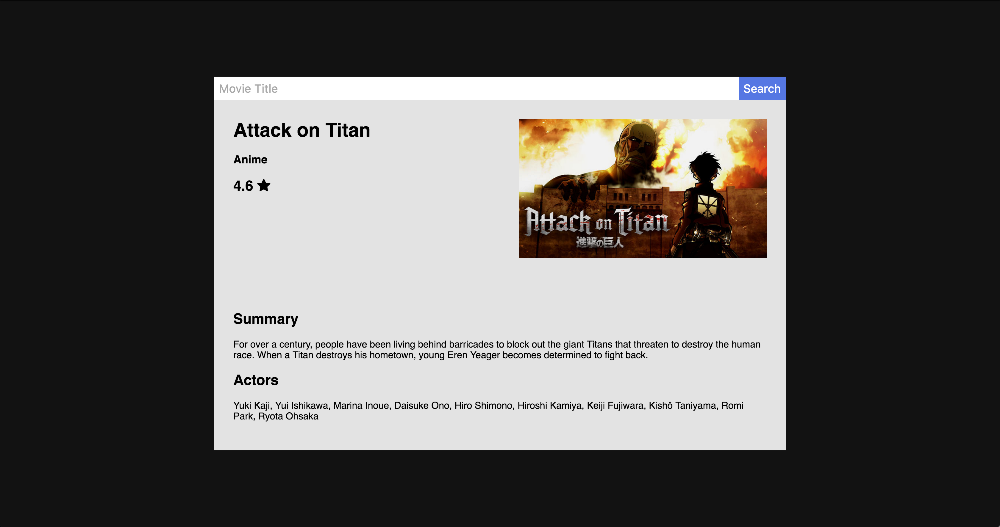

# Netflix Result

## Description

Working with the DOM is hard.
Here is an exercise to practice with a smaller piece of DOM.

## Objectives

### Learning Objectives

After completing this assignment, you should be able to:

* Trigger JS apps from an HTML file using `require`.
* Fetch JSON data from a server using `fetch`

### Review Objectives

After completing this assignment, you should be able to effectively use:

* Select DOM elements
* Create DOM elements
* Set classes and text content of elements
* Listen for events using `addEventListener`
* Decide steps to take based on failing tests
* Understand JS Syntax
* Manage `for` loops over Arrays
* Use `if` and `else` statements
* Create HTML for non-JS based UI
* Style applications using SCSS

## Details

### Deliverables

* A project created using `yo qunit-broccoli`

### Requirements

Recreate the following design using HTML created via Javascript with results from the Netflix Roulette API.
Then style to match the design.



## Getting Started Tasks

```
* [ ] Create a new project using `yo qunit-broccoli` named `10-netflix-result`
* [ ] Run `hub create` to
* [ ] Create `develop` branch
* [ ] Change the title of the page
* [ ] Commit changes, push, and create a pull request using `hub pull-request`
* [ ] Submit PR link in TIYO
```

## Explorer Difficulty

```
* [ ] Recreate the design using HTML and CSS (without getting data via JS) to help understand what HTML you will need to fill in
* [ ] Create a new module called `netflix-result`
  - [ ] Export a function that takes two arguments: an element and a movie title
  - [ ] When run, the `netflixResult` function fetches data from `http://netflixroulette.net/api/api.php?title=Attack%20on%20titan` where `Attack%20on%20titan` is replaced with the move title from the function arguments
  - [ ] After fetching the data, fill the element passed in via arguments with the HTML required to recreate your static design
* [ ] Create a new module called `index`
  - [ ] Export a function that takes one argument: an application element
  - [ ] When run, the `index` function should look for a Netflix result for a title (use a hard coded string for now) and fill in the element argument
* [ ] Wire up the application in your HTML
  - [ ] Select the HTML element that will be the outer edge of your application
  - [ ] Load the `index` module in your HTML file
  - [ ] Run the `index` function passing in the element from earlier
```

## Easy Difficulty

For this difficulty, you will be adding a working search bar to the page.
When the search bar is filled in and a button is pressed, the results should run again and the application should be updated to show results.

```
* [ ] Add HTML for search bar and button
* [ ] Style search bar and button
* [ ] Add an arguments to the index function for the input and button elements
* [ ] Select the input and button elements in your `index.html` file
* [ ] Pass in all the required arguments to the `index` function
* [ ] Update index module to listen for clicks on the button element
* [ ] When the button is clicked...
  - [ ] Look up the input text
  - [ ] Update element based on user input and results from Netflix Roulette
```
