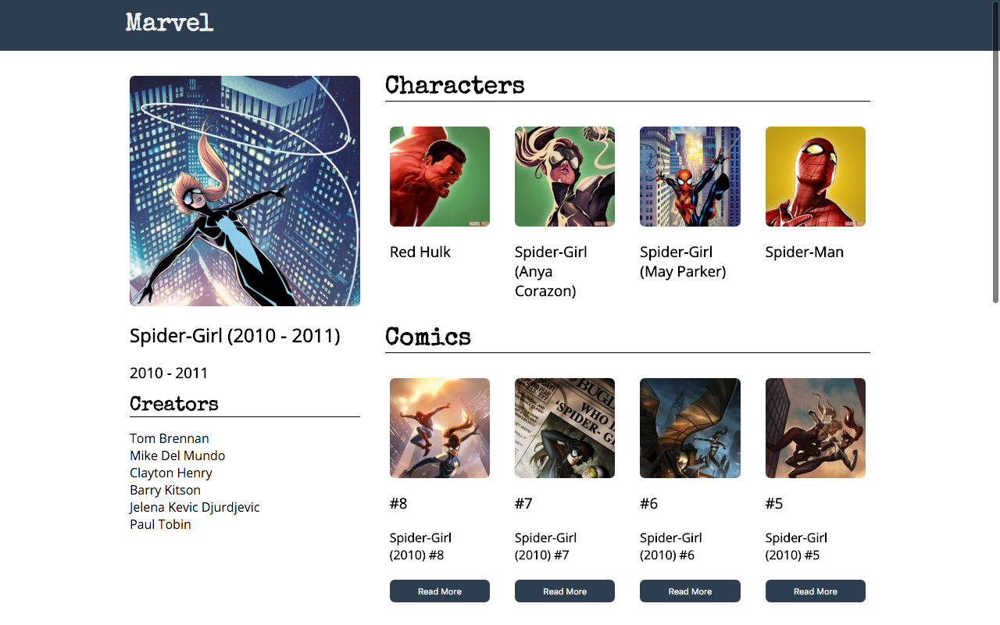
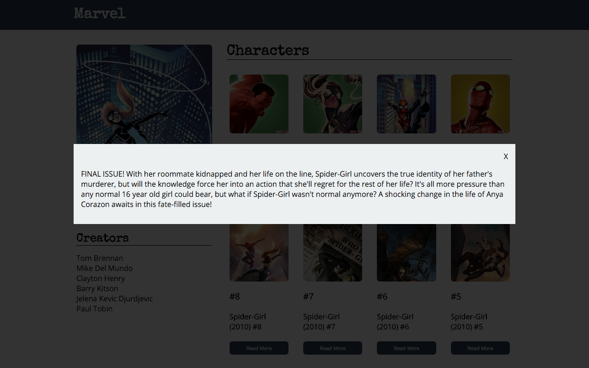

# Marvel Series Profile

## Description

It's time to get serious about HTML, CSS, and Javascript. For this assignment you will be creating a profile page for a Marvel Comic Series.

## Objectives

### Learning Objectives

After completing this assignment, you should be able to:

- Export Javascript modules
- Use Javascript classes to group behavior
- Add classes to HTML to represent application state
- Use `fetch` to make requests to an API

### Review Objectives

After completing this assignment, you should be able to effectively use:

- Create DOM Elements with Javascript
- Modify DOM Elements with Javascript
- Select DOM Elements with Javascript
- Style using SCSS

## Details

### Deliverables

- A project created using the Yeoman Qunit Broccoli Generator `yo qunit-broccoli`

Retrieve information for a comic series using the [Marvel API](developer.marvel.com) for the series, it's characters, and it's comics.

Using the fetched information recreate the following design:



When a user clicks on the "Read More" button pop up a model (using similar `position: fixed` as the modal assignment) showing the description of a comic.



The modal should go away when the "X" is clicked

### Requirements

Write a classes for:

- `SeriesInfoView` - fills in the HTML for the sidebar given a set of data from
- `CharacterView` - fills in the HTML for a single character
- `CharacterListView` - creates `CharacterView`s for each character result
- `ComicView` - fills in the HTML for a single character and deals with the `active` class for the modal
- `ComicListView` - creates `ComicView`s for each character result

## Resources

- Perfectly Square images without stretching: <http://www.mademyday.de/css-height-equals-width-with-pure-css.html>

## Tasks

```
* [ ] Create a new project named "13 Marvel Profile" using the `yo qunit-broccoli` command
* [ ] Run `hub create` to create a new repository on Github
* [ ] Push `master` branch
* [ ] Create `develop` branch
* [ ] Create an API Key on http://developer.marvel.com/documentation/getting_started
* [ ] Add `localhost` to your authorized referrers on https://developer.marvel.com/account
* [ ] Explore the interactive documentation for the [Series Details](http://developer.marvel.com/docs#!/public/getSeriesIndividual_get_26) Try series id `9856` for Spider Girl
* [ ] Create HTML in `index.html` for styling and layout (this will be replaced by JS content SOON!)
  - [ ] Top Nav
  - [ ] Series Details Sidebar
  - [ ] Characters
  - [ ] Comics
  - [ ] Modal
* [ ] Create `index` module
  - This will start up your application and take in a single element that includes all of the areas of your app
  - [ ] Export a function to start up the application
* [ ] Require `index` module from HTML file and call this variable `start`
  - [ ] Call the `start` function and pass in a single element that contains all parts of the application that need to be filled in
* [ ] Create `series-info-view` module
  - [ ] Export SeriesInfoView class
    * [ ] Constructor
      - [ ] Arguments
        * [ ] An element to modify
        * [ ] Data from Marvel API `/series/{id}`
      - [ ] Setup any preselected elements as `this.elements` to help later when filling things in
    * [ ] Create a `render` method in `SeriesInfoView` to fill in Series Data into EXISTING HTML
      - [ ] Image SRC
      - [ ] Title
      - [ ] Start Date
      - [ ] End Date
      - [ ] Loop through each creator
        + [ ] Append creators to list of creators
* [ ] In the `index` module `fetch` Series data
  - [ ] Parse response using `res.json()`
  - [ ] Create a new `series-info-view` instance with the data returned from the API
  - [ ] Call `render` on the instance of `series-info-view`
* [ ] Create `character-list-view` module
  - [ ] Export CharacterListView class
    * [ ] Constructor should accept
      - [ ] Arguments
        * [ ] An element to fill in with characters
        * [ ] Data from Marvel API `/series/{id}/characters`
    * [ ] `render` method
      - [ ] Loop through each character result from the data set
        * [ ] Create new instance of `character-view`
        * [ ] Call `render` on new `character-view` instance
        * [ ] Append element from CharacterView into list element
* [ ] Create `character-view` module
  - [ ] Export CharacterView class
    * [ ] Constructor should accept
      - [ ] A single result from Marvel API `/series/{id}/characters` (not the full array)
      - [ ] Create a new element that represents a single character
      - [ ] Set any classes needed for character object
      - [ ] Create empty character element
        * [ ] Character thumbnail
        * [ ] Character name
    * [ ] `render` method
      - [ ] Fill in HTML with data for the current character
        * [ ] Character thumbnail
        * [ ] Character name
* [ ] In `index` module, `fetch` Character data for a series `/series/{id}/characters`
  - [ ] Parse response using `res.json()`
  - [ ] Create a new `character-list-view` instance with character list element & the data returned from the API
  - [ ] Call `render` on instance of `character-list-view`
* [ ] Create `comic-list-view` module
  - [ ] Export ComicListView class
    * [ ] Constructor should accept
      - [ ] An element to fill in with comics
      - [ ] Data from Marvel API `/series/{id}/comics`
    * [ ] `render` method
      - [ ] Loop through each comic result from the data set
        * [ ] Create new instance of `comic-view`
        * [ ] Call `render` on new `comic-view` instance
        * [ ] Append element from ComicView into list element
* [ ] Create `comic-view` module
  - [ ] Export ComicView class
    * [ ] Constructor should accept
      - [ ] A single result from Marvel API `/series/{id}/comics` (not the full array)
      - [ ] Create a new element that represents a single comic
      - [ ] Set any classes needed for comic object
      - [ ] Create empty comic element
        * [ ] Comic thumbnail
        * [ ] Comic issue number
        * [ ] Comic title
        * [ ] Comic description (in the modal card)
      - [ ] Listen for click of the "Read More"
        * [ ] Toggle a class on the modal for THIS comic to make it show
      - [ ] Listen for click of the "X" in the modal
        * [ ] Toggle a class on the modal for THIS comic to make it hide away
    * [ ] `render` method
      - [ ] Fill in HTML with data for the current character
        * [ ] Comic thumbnail
        * [ ] Comic issue number
        * [ ] Comic title
        * [ ] Comic description (in the modal card)
* [ ] `fetch` Comic data for a series `/series/{id}/comics`
  - [ ] Parse response using `res.json()`
  - [ ] Create a new `comic-list-view` instance with comic list element & the data returned from the API
  - [ ] Call `render` on instance of `comic-list-view`
```

- Todos Gist for following along: <https://gist.github.com/rtablada/e7a0f4e597ad00666dd4>
