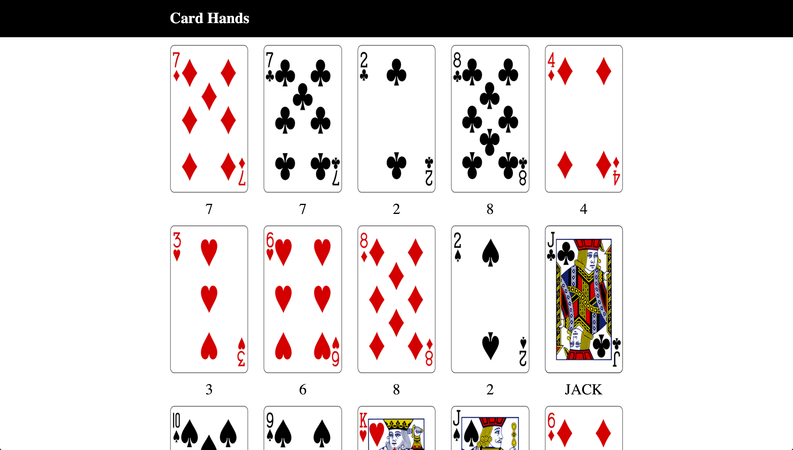

# Card Hands

## Description

Now that we

## Objectives

### Learning Objectives

After completing this assignment, you should be able to:

- Fetch from multiple URLs for different or repeated data
- Render data from arrays using `forEach`
- Break arrays into more manageable chunks using `map`

### Review Objectives

After completing this assignment, you should be able to effectively use:

- Export Javascript modules
- Use Javascript classes to group behavior
- Add classes to HTML to represent application state
- Use `fetch` to make requests to an API
- Create DOM Elements with Javascript
- Modify DOM Elements with Javascript
- Select DOM Elements with Javascript
- Style using SCSS

### Grading Criteria

* Use of `map`
* Use of `forEach`
* Use of `fetch`
* Implementation of "ROCK SOLID layout" with responsive grid

## Details

### Deliverables

- A project created using the Yeoman Qunit Broccoli Generator `yo qunit-broccoli`

Retrieve information for shuffled hands of cards using `http://card-proxy.herokuapp.com` (more data on the API below and in the task list)

Using the fetched information recreate the following design (your card values WILL vary for each refresh):



You should draw five hands and have a layout based on the "ROCK SOLID layout" we've reviewed in class: http://codepen.io/rtablada/pen/yJPyBz

### Requirements

Write a classes/modules for:

- `App`
  * Constructor
    - Accepts
      * Application Element
    - Stores
      * Any elements and/or sub elements
  * `start`
    - Fires off `fetch` request to `https://card-proxy.herokuapp.com/decks/new`
    - Waits for this request to finish and creates five (5) new instances of `Hand` and...
      * passes in the `deck_id` from the fetched data
      * appends the hand instance's element to the list of hands in the DOM
      * runs `getData` on the hand instance, waits for this to complete, then runs `render` on the hand instance
- `Hand`
  * Constructor
    - Accepts
      * A deck id
    - Creates
      * An empty element to fill in with data from a hand
    - Stores
      * Any elements and/or sub elements
  * `getData`
    - Fetches data for five cards using the url `https://card-proxy.herokuapp.com/decks/deck_id/draw?count=5`
      * Replace `deck_id` with the deck id for the current hand instance
    - After fetching data, store it on the current hand instance
    - Return `fetch` so that other parts of the app can wait for `getData` to complete
  * `render`
    - Appends card images to a list of card images using `forEach` on the dataset for the current hand
    - Groups only the `value` for all of the cards
      * Loop through this group of values and...
        - Appends card values to a list of card values using `forEach` on the dataset for the current hand

## Tasks

```
* [ ] Create a new project named "14 Card Hands" using the `yo qunit-broccoli` command
* [ ] Run `hub create` to create a new repository on Github
* [ ] Push `master` branch
* [ ] Create `develop` branch
* [ ] Create HTML in `index.html` for styling and layout to mockup the layout
  - [ ] Top Nav
  - [ ] List of hands
  - [ ] List of cards
  - [ ] List of values
* [ ] Rename `index` module to `app`
  - `App` class
    * Constructor
      - Accepts
        * Application Element
      - Stores
        * Any elements and/or sub elements
    * `start`
      - Fires off `fetch` request to `https://card-proxy.herokuapp.com/decks/new`
      - Waits for this request to finish and creates five (5) new instances of `Hand` and...
        * passes in the `deck_id` from the fetched data
        * appends the hand instance's element to the list of hands in the DOM
        * runs `getData` on the hand instance, waits for this to complete, then runs `render` on the hand instance
* [ ] `require` the `app` module in `index.html`
  - [ ] Create a new instance of the `App` class
    * [ ] Pass in application element
  - [ ] Call `start` on the new instance of `App`
* [ ] Create a module called `hand`
  - `Hand`
    * Constructor
      - Accepts
        * A deck id
      - Creates
        * An empty element to fill in with data from a hand
      - Stores
        * Any elements and/or sub elements
    * `getData`
      - Fetches data for five cards using the url `https://card-proxy.herokuapp.com/decks/deck_id/draw?count=5`
        * Replace `deck_id` with the deck id for the current hand instance
      - After fetching data, store it on the current hand instance
      - Return `fetch` so that other parts of the app can wait for `getData` to complete
    * `render`
      - Appends card images to a list of card images using `forEach` on the dataset for the current hand
      - Groups only the `value` for all of the cards
        * Loop through this group of values and...
          - Appends card values to a list of card values using `forEach` on the dataset for the current hand
```
